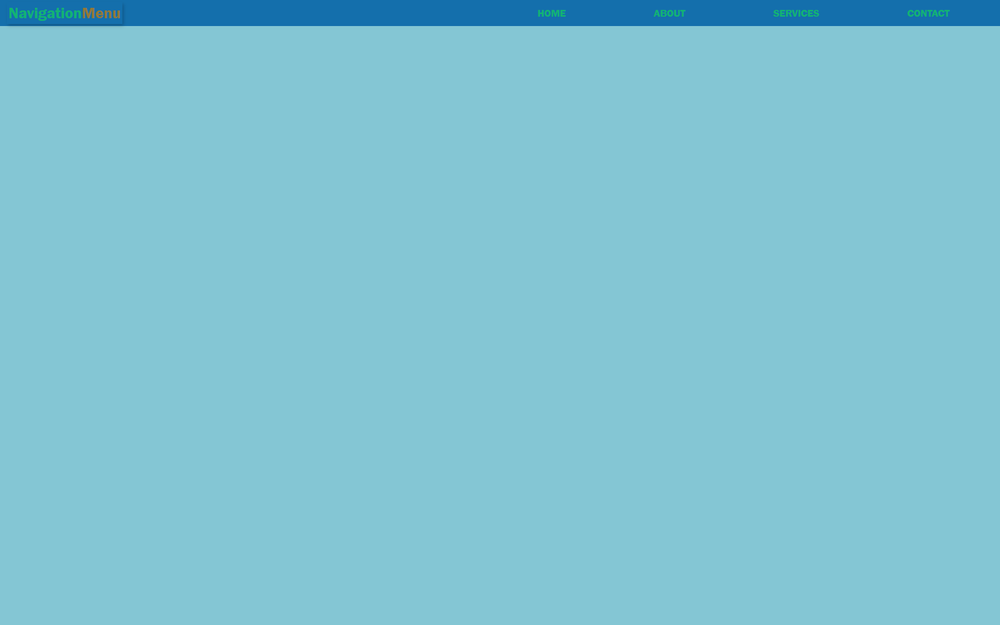

# Navigation Menu

- A Basic Navigation Menu.
- Made with HTML, CSS, SCSS, and Javascript.
- Responsive to different screen sizes using media queries.

## Features 🚀

1. Hover effect on links for a smooth transition when the mouse is placed over them.
1. Active link highlighting in color (you can change it by modifying the css).
1. The navigation menu will automatically close if you click outside of it or use the escape key.
1. Clicking on an open submenu will also close any other open submenus.
1. Submenu items have their own hover effects that reveal themselves as they are moved into view.
1. Uses simple vanilla JavaScript without any frameworks/libraries.

## How To Use 🤔

1. Download or clone this repository onto your local machine.
1. Extract css from scss file.
1. Open `index.html` file located at the `./index.html` using a web browser.
1. You should see a basic responsive navigation menu displayed.

## Preview This Project.

## 
<a href="https://navigationmenu-codequillcrafts.netlify.app" target=_blank>View Live</a>

